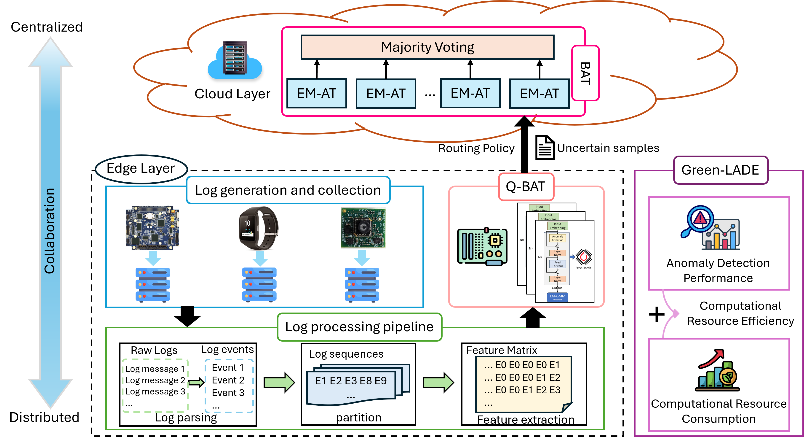
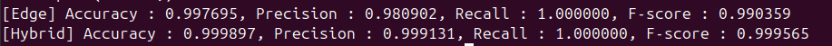

# CECO-LAD

**Cloud-Edge Collaborative Log Anomaly Detection**

[](https://www.python.org/)
[](https://pytorch.org/)
[](LICENSE)
[](https://kismetzz-ceco-lad.hf.space/)

**[🤗 Try the live demo on Hugging Face Spaces](https://kismetzz-ceco-lad.hf.space/)**

---

## How It Works

CECO-LAD detects anomalies in system logs using a hybrid Cloud-Edge collaboration pipeline:

- **Edge-side LAD** using Q-BAT model that runs locally on resource-constrained edge devices.
- Only the **most uncertain lines** are forwarded to the **cloud-side LAD** using BAT model for more accurate reevaluation.

<p align="center">
  
</p>

### Models

| Model     | Where | What                                                                                                        |
| --------- | ----- | ----------------------------------------------------------------------------------------------------------- |
| **BAT**   | Cloud | Bagging-style ensemble of 81 EM-AT models with varied hyperparameters and bootstrap-resampled training data |
| **Q-BAT** | Edge  | Bagging-style ensemble of 3 quantized EM-AT base models                                                     |

### Framework Overview

System logs are first generated from diverse servers and applications and collected by distributed log collection servers. A log processing pipeline then parses raw log messages into structured formats, partitions them into sequences, and converts them into feature matrices as input for the anomaly detector. For deployment in heterogeneous cloud-edge environments, CECO-LAD adopts a collaborative inference strategy: the BAT model is hosted on the cloud server, while the lightweight Q-BAT model runs on resource-constrained edge devices. A Mahalanobis distance-based routing policy enables collaborative anomaly analysis, forwarding hard cases from the edge to the cloud for more accurate prediction. Finally, the Green-LADE method is integrated to assess computational resource efficiency, quantifying the trade-off between resource consumption and detection capability across cloud and edge deployments.

### Paper ↔ Code Mapping

| Paper component                                               | Code location                                                                                                                    |
| ------------------------------------------------------------- | -------------------------------------------------------------------------------------------------------------------------------- |
| Log preprocessing (raw logs → feature matrix)                 | [ceco_core/data/](ceco_core/data/)                                                                                               |
| Enhanced Anomaly Transformer (EM-AT) base learner             | [ceco_core/models/](ceco_core/models/)                                                                                           |
| BAT — Bagging-style AT (training)                             | [training_pipeline/](training_pipeline/)                                                                                         |
| Q-BAT — Quantized bagging-style AT (A8W4 + ExecuTorch export) | [quantization/qbat_export.py](quantization/qbat_export.py)                                                                       |
| Edge-side LAD using Q-BAT                                     | [ceco_lad_inference_pipeline/lad_qbat_edge.py](ceco_lad_inference_pipeline/lad_qbat_edge.py)                                     |
| Mahalanobis distance-based routing policy                     | [ceco_lad_inference_pipeline/routing.py](ceco_lad_inference_pipeline/routing.py)                                                 |
| Cloud-side LAD using BAT for reevaluation on routed samples   | [ceco_lad_inference_pipeline/lad_bat_cloud.py](ceco_lad_inference_pipeline/lad_bat_cloud.py)                                     |
| Cloud–edge collaborative inference pipeline                   | [ceco_lad_inference_pipeline/run.py](ceco_lad_inference_pipeline/run.py), [dashboard/cloud_runner.py](dashboard/cloud_runner.py) |

---

## Repository Structure

`run.py` is the primary entry point — a single CLI that dispatches every pipeline stage (download, train, eval, convert, infer). `launch_dashboard.py` is an optional local helper that bundles asset download with launching the web UI. Everything else falls into one of three groups — **shared library**, **pipeline stages**, or **supporting assets**.

<pre>
CECO-LAD/
│
│ ── Entry points (run from project root) ─────────────────────────────────
├── run.py                         # Main CLI: download | train | eval | convert | infer
├── launch_dashboard.py            # Optional local helper: fetch assets + start the web UI
│
│ ── Shared library ───────────────────────────────────────────────────────
├── ceco_core/                     # Imported by every pipeline below
│   ├── models/                    #   EM-AT architecture (attention, embedding)
│   ├── data/                      #   Dataset loaders + log preprocessor
│   └── utils/                     #   Energy scoring, voting, config I/O, metrics
│
│ ── Pipeline stages ──────────────────────────────────────────────────────
├── training_pipeline/             # 1. Train BAT ensemble (81 EM-AT models)
│   ├── train.py                   #    Hyperparameter sweep
│   ├── solver.py                  #    EM-AT base model training
│   └── evaluate.py                #    Per-model evaluation
│
├── quantization/                  # 2. Convert BAT → Q-BAT
│   └── qbat_export.py             #    A8W4 quantize, export to ExecuTorch .pte
│
├── <b>🔴 ceco_lad_inference_pipeline/</b>   # 3. CECO-LAD collaborative inference pipeline: Edge → routing → cloud
│   ├── lad_qbat_edge.py           #    Edge-side LAD using Q-BAT via ExecuTorch
│   ├── routing.py                 #    Mahalanobis distance-based routing (uncertain → cloud)
│   ├── lad_bat_cloud.py           #    Cloud-side LAD using BAT for reevaluation
│   ├── run.py                     #    Pipeline driver: runs stages 1–4
│   └── executorch/                #    Pre-built ExecuTorch runtime (fetched by `run.py download`)
│
├── dashboard/                     # 4. Front-end UI for visualization
│
│ ── Configuration & data ─────────────────────────────────────────────────
├── configs/
│   ├── training/{bgl,hdfs,os}.yaml
│   └── inference/{bgl,hdfs,os}.yaml
│
├── data/                          # Pre-processed log event sequences
├── outputs/                       # Thresholds, predictions
├── checkpoints/                   # bat/*.pth + qbat/*.pte — fetched by `run.py download`
├── logs/                          # Training & inference logs
│
├── environment/                   # Python dependency lists
│   ├── cloud/requirements.txt     #   Training, eval, cloud inference
│   └── edge/requirements.txt      #   ExecuTorch edge inference, dashboard
│
│ ── Tooling ──────────────────────────────────────────────────────────────
└── tools/
    ├── download_checkpoints.py    # Fetch BAT / Q-BAT checkpoints
    ├── download_data.py           # Fetch ExecuTorch runtime + raw logs
    └── deploy/                    # Maintainer-only — Hugging Face Space deployment
</pre>

---

## Full Setup

All commands run from the project root. CECO-LAD uses **two Conda environments**, one for each inference tier:

| Environment      | Tier      | Stack                              | What runs in it                                                                                                                                     |
| ---------------- | --------- | ---------------------------------- | --------------------------------------------------------------------------------------------------------------------------------------------------- |
| `ceco-lad-edge`  | **Edge**  | PyTorch 2.6 (CPU) + ExecuTorch 0.5 | Dashboard, Q-BAT edge inference (`.pte` via ExecuTorch), pipeline orchestration. CPU is sufficient.                                                 |
| `ceco-lad-cloud` | **Cloud** | PyTorch 2.4 + CUDA 12.4            | BAT ensemble training (81 models) and cloud re-check inference. GPU strongly recommended; the inference pipeline launches this env as a subprocess. |

**Why two environments?** Edge and cloud have different runtime needs. Edge uses ExecuTorch (compact, CPU-only, runs `.pte` quantized models), while cloud uses full-precision PyTorch with CUDA. Splitting them keeps each install minimal and avoids version conflicts between ExecuTorch and CUDA PyTorch.

### Step 1 — Set up environments

#### Edge environment (`ceco-lad-edge`)

```bash
conda create -yn ceco-lad-edge python=3.10.0
conda activate ceco-lad-edge
pip install -r environment/edge/requirements.txt \
    --extra-index-url https://download.pytorch.org/whl/cpu
pip install -e .
```

ExecuTorch **0.5.0** ([docs](https://docs.pytorch.org/executorch/0.5/)) and its bundled `torchao` build are downloaded and installed automatically in Step 2 below (or by `launch_dashboard.py`) — no manual compilation needed (they carry PEP 440 local version labels and are not on PyPI, hence commented out in `requirements.txt`). **Linux/macOS only**; Windows users: use WSL2.

#### Cloud environment (`ceco-lad-cloud`)

```bash
conda create -yn ceco-lad-cloud python=3.10.0
conda activate ceco-lad-cloud
pip install -r environment/cloud/requirements.txt \
    --extra-index-url https://download.pytorch.org/whl/cu124
pip install -e .
```

> Edge and cloud install **different** requirements files and PyTorch builds (CPU vs CUDA), so they must be separate envs. The inference pipeline also relies on this split: edge orchestrates and spawns cloud inference as a subprocess pointed at the cloud env's interpreter.

**Verify both environments exist:**

```bash
conda env list   # should list both 'ceco-lad-edge' and 'ceco-lad-cloud'
```

### Step 2 — Download checkpoints and the edge runtime

`run.py` is the project's main entry point. Use `run.py download` to fetch the BAT (`.pth`) and Q-BAT (`.pte`) checkpoints required by the inference pipeline. Whenever Q-BAT checkpoints are part of the download, `run.py` _also_ installs the **ExecuTorch 0.5.0 runtime** (and its bundled `torchao` build) — these are required by `run.py infer` (edge stage) and `run.py convert`.

```bash
conda activate ceco-lad-edge
python run.py download                # all datasets, both checkpoint types + ExecuTorch runtime
python run.py download bgl            # one dataset (BAT + Q-BAT) + ExecuTorch runtime
python run.py download bgl bat        # BGL full-precision only (no ExecuTorch needed)
python run.py download bgl qbat       # BGL quantized Q-BAT + ExecuTorch runtime
```

> **Note:** raw log files are _not_ fetched here — they are only needed for the optional web dashboard's log-browsing panels and are downloaded by `launch_dashboard.py` (see "Optional — Launch the local dashboard" below).

### Step 3 — Run the full pipeline from the CLI

`run.py` dispatches every pipeline stage. Pre-computed thresholds for all three datasets are bundled with the repository, so you can run inference immediately:

```bash
conda activate ceco-lad-edge
python run.py infer os                # edge scan → routing → cloud re-check → final prediction
python run.py infer bgl
python run.py infer hdfs
```

For other stages — `train`, `convert` — see [Advanced Options](#advanced-options).

### Optional — Launch the local dashboard

`launch_dashboard.py` wraps the inference pipeline in a web UI at **http://localhost:8765**. It performs the same checkpoint + ExecuTorch download as `run.py download`, and additionally fetches the **raw log files** needed for the dashboard's log-browsing panels:

```bash
conda activate ceco-lad-edge
python launch_dashboard.py                # full setup (ExecuTorch + Q-BAT + raw logs + BAT) + launch UI
python launch_dashboard.py --setup-only   # download assets, do not launch
python launch_dashboard.py --no-bat       # skip BAT checkpoints (~3.5 GB × dataset)
python launch_dashboard.py --status       # show what is present / missing, then exit
```

A built-in **? Help** button in the dashboard guides you through all features. On first launch the **Database** indicator shows **Loading** while log data is imported.

---

## Advanced Options

### Cloud-side re-check only

If the edge phase has already been run and you only want to re-run the cloud-side BAT re-prediction step:

```bash
conda activate ceco-lad-cloud
python dashboard/cloud_runner.py --config configs/inference/os.yaml
```

### Train from scratch

```bash
conda activate ceco-lad-cloud
python run.py train os
python run.py train bgl
python run.py train hdfs
```

Each `train` invocation runs a hyperparameter sweep over `(num_epochs, k, e_layer_num, batch_size)` and writes **81 BAT checkpoints** to `checkpoints/bat/<dataset>/`.

### Convert to edge models

```bash
conda activate ceco-lad-edge
python run.py convert os
python run.py convert bgl
python run.py convert hdfs
```

Applies quantization techniques and exports `.pte` files to `checkpoints/qbat/{dataset}/`. Skip if you already downloaded Q-BAT checkpoints via `python run.py download <dataset> qbat`.

---

## Results

### OpenStack

<p align="center">
  
</p>

### HDFS

<p align="center">
  
</p>

### BGL

<p align="center">
  
</p>
