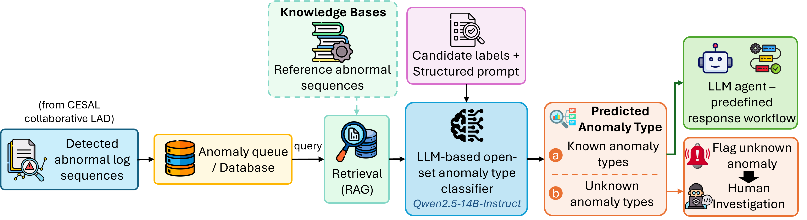

# CESAL

**Cloud–Edge Security Analytics for Log-Based Incident Detection, Classification, and Controlled Response**

[](https://www.python.org/)
[](https://pytorch.org/)
[](LICENSE)
[](https://kismetzz-ceco-lad.hf.space/)

**[🤗 Try the live demo on Hugging Face Spaces](https://kismetzz-ceco-lad.hf.space/)**

---

## How It Works

An **edge-first, cloud-assisted** pipeline, in four stages:

- **Edge detection** — Q-BAT, an ensemble of quantized EM-AT models, scores log sequences on the device itself.
- **Uncertainty routing** — a Mahalanobis distance policy keeps confident samples local and escalates only the most uncertain (10% by default), limiting how much security-sensitive log data leaves the edge.
- **Cloud verification** — BAT, an ensemble of 81 EM-AT models, re-evaluates what was escalated.
- **Classification and response** — detected sequences are queued, labelled by a retrieval-augmented LLM as a known anomaly type or unknown, and mapped to a predefined response workflow; unknown ones go to a human.

<p align="center">
  
</p>

### Framework Overview

CESAL is a security-aware cloud-edge framework for log-based incident detection, classification, and controlled response. Raw logs generated by cloud servers, gateways, and edge devices are collected near their sources, parsed, and converted into structured log sequences. The collaborative LAD pipeline then applies Q-BAT for lightweight edge-side inference and BAT for high-capacity cloud-side verification of selected uncertain samples. A Mahalanobis distance-based routing policy estimates edge-side prediction uncertainty and forwards only samples near the decision boundary to the cloud. This edge-first design keeps confident samples local, reduces unnecessary edge-to-cloud transmission of security-sensitive logs, and preserves strong detection performance. After abnormal sequences are detected, CESAL can optionally invoke a cloud-side LLM-based open-set classification and controlled response module. With retrieval-augmented generation (RAG), the module classifies each detected abnormal sequence into a predefined anomaly type or assigns it to the "Unknown Anomaly Types" class when no known category is sufficiently supported. Known anomaly types are mapped to predefined response workflows to support controlled mitigation through the LLM agent, while unknown anomaly types are preserved and flagged for human investigation.

### Models

**EM-AT — the base learner.** Its Anomaly Attention scores each sequence by the divergence between a _series association_ (global dependencies) and a _prior association_ (local adjacency), combined with reconstruction error. EM-AT adds **EM-GMM-based automated thresholding** — a Gaussian mixture fitted to the score distribution sets the cut-off from the estimated normal proportion, so no per-device tuning is needed.

**BAT — the cloud detector.** A single EM-AT is sensitive to its training sample and hyperparameters, especially for rare anomalies. BAT ensembles **81** EM-AT learners, each on a bootstrap subset with a different configuration (epochs, loss weight, encoder depth, batch size), each with its own EM-GMM threshold, combined by majority vote.

**Q-BAT — the edge detector.** For efficient edge-side inference, Q-BAT keeps **3** learners and quantizes them with TorchAO (8-bit activations, 4-bit weights), exporting each as an ExecuTorch program — ensemble robustness at a size a Raspberry Pi can run.

**LLM classifier.** Qwen2.5-14B-Instruct by default. Retrieved reference sequences plus open-set decision rules label each detected sequence as one of 10 known HDFS anomaly types or unknown, which then selects a response workflow.

### Paper ↔ Code Mapping

| Paper component                                                                                                           | Code location                                                                                                                                                    |
| ------------------------------------------------------------------------------------------------------------------------- | ---------------------------------------------------------------------------------------------------------------------------------------------------------------- |
| Log data processing: sequences → sliding context windows (Sec. 3.4; datasets are provided already parsed into log events) | [cesal_core/data/](cesal_core/data/)                                                                                                                             |
| EM-AT base learner (Sec. 3.5.1)                                                                                           | [cesal_core/models/](cesal_core/models/)                                                                                                                         |
| EM-GMM automated thresholding (Sec. 3.5.1)                                                                                | [training_pipeline/solver.py](training_pipeline/solver.py) (BAT), [cesal_inference_pipeline/lad_qbat_edge.py](cesal_inference_pipeline/lad_qbat_edge.py) (Q-BAT) |
| BAT training (Sec. 3.5.2, Algorithm 1)                                                                                    | [training_pipeline/](training_pipeline/)                                                                                                                         |
| Q-BAT quantization and ExecuTorch export (Sec. 3.5.3)                                                                     | [quantization/qbat_export.py](quantization/qbat_export.py)                                                                                                       |
| Edge-side inference with Q-BAT (Sec. 3.6, Algorithm 2)                                                                    | [cesal_inference_pipeline/lad_qbat_edge.py](cesal_inference_pipeline/lad_qbat_edge.py)                                                                           |
| Mahalanobis distance-based routing policy (Sec. 3.6.1, Algorithm 3)                                                       | [cesal_inference_pipeline/routing.py](cesal_inference_pipeline/routing.py)                                                                                       |
| Cloud-side verification with BAT (Sec. 3.6, Algorithm 2)                                                                  | [cesal_inference_pipeline/lad_bat_cloud.py](cesal_inference_pipeline/lad_bat_cloud.py)                                                                           |
| Cloud–edge collaborative inference pipeline (Sec. 3.6)                                                                    | [cesal_inference_pipeline/run.py](cesal_inference_pipeline/run.py), [dashboard/cloud_runner.py](dashboard/cloud_runner.py)                                       |
| Edge-side and cloud-side anomaly queues Q_E / Q_C (Sec. 3.1)                                                              | [incident_response/queues.py](incident_response/queues.py)                                                                                                       |
| RAG-based evidence retrieval and LLM open-set incident classification (Sec. 3.7)                                          | [incident_response/classifier.py](incident_response/classifier.py)                                                                                               |
| Predefined response workflows and escalation policy (Sec. 3.7, Table 1)                                                   | [incident_response/workflows.py](incident_response/workflows.py)                                                                                                 |
| Queued incidents → classification → response workflow (Sec. 3.1, 3.7)                                                     | [incident_response/process_queues.py](incident_response/process_queues.py)                                                                                       |
| Open-set incident classification evaluation (Sec. 4.6, Table 7)                                                           | [incident_response/evaluate.py](incident_response/evaluate.py), [incident_response/data_prep.py](incident_response/data_prep.py)                                 |

---

## Full Setup

All commands run from the project root. CESAL uses **two Conda environments**, one for each inference tier:

| Environment   | Tier      | Stack                                       | What runs in it                                                                                                                                                                                                             |
| ------------- | --------- | ------------------------------------------- | --------------------------------------------------------------------------------------------------------------------------------------------------------------------------------------------------------------------------- |
| `cesal-edge`  | **Edge**  | PyTorch 2.6 (CPU) + ExecuTorch 0.5          | Dashboard, Q-BAT edge inference (`.pte` via ExecuTorch), pipeline orchestration. CPU is sufficient.                                                                                                                         |
| `cesal-cloud` | **Cloud** | PyTorch 2.4 + CUDA 12.4 + transformers 4.47 | BAT ensemble training (81 models), cloud re-check inference, and LLM-based incident classification and response (`incident_response/`). GPU strongly recommended; the inference pipeline launches this env as a subprocess. |

**Why two?** Edge runs ExecuTorch (compact, CPU-only, `.pte` quantized models); cloud runs full-precision PyTorch with CUDA. Separating them keeps each install minimal and avoids version conflicts between the two.

**Two ways through the artifact.** The full lifecycle runs left to right; the trained checkpoints are published, so the numbered steps below skip the two most expensive stages:

```
  train BAT ensemble ──▶ convert to Q-BAT ──▶ detection ──▶ classification ──▶ response
      (81 models)          (quantize)          Step 3         Step 4            Step 4
           └────────── replaced by Step 2: download ──────────┘
```

**To reproduce the paper**, follow Steps 1–4: the published BAT and Q-BAT checkpoints go straight from install to results. **To rebuild the models from scratch**, do [Train the BAT ensemble](#train-the-bat-ensemble-from-scratch) and [Convert BAT to Q-BAT](#convert-bat-to-q-bat-edge-models) in place of Step 2, then rejoin at Step 3 — the rest of the pipeline is identical.

### What you need to run CESAL

Far less than the paper's testbed ([Hardware setup](#hardware-setup-section-41) records what the published numbers were measured on).

| Purpose                              | Requirement                                                                                                                             |
| ------------------------------------ | --------------------------------------------------------------------------------------------------------------------------------------- |
| Edge stage, dashboard, unit tests    | x86-64 CPU, 16 GB RAM. **No GPU needed.**                                                                                               |
| Cloud BAT ensemble (81 EM-AT models) | One CUDA GPU; 16 GB VRAM is sufficient.                                                                                                 |
| LLM incident classification          | One CUDA GPU, 16 GB VRAM (verified on an RTX 2000 Ada). Models larger than VRAM are partly offloaded to CPU RAM — slower, but it works. |
| Edge resource measurements (Table 6) | Physical Raspberry Pi 3B+/4B/5. Not reproducible without that hardware.                                                                 |

**Disk** — budget about **40 GB** for a full HDFS + OpenStack run:

| Item                                         | Size                |
| -------------------------------------------- | ------------------- |
| Repository clone                             | ~31 MB              |
| BAT checkpoints (81 `.pth` per dataset)      | ~3.5 GB per dataset |
| ExecuTorch runtime + build tree              | ~1.4 GB             |
| Raw HDFS logs (dashboard log browser only)   | ~1.6 GB             |
| Dashboard SQLite database (built at runtime) | ~5.4 GB             |
| Prediction outputs per dataset               | ~1.2 GB             |

### Step 1 — Set up environments

#### Edge environment (`cesal-edge`)

```bash
conda create -yn cesal-edge python=3.10.0
conda activate cesal-edge
pip install -r environment/edge/requirements.txt \
    --extra-index-url https://download.pytorch.org/whl/cpu
pip install -e .
```

ExecuTorch **0.5.0** ([docs](https://docs.pytorch.org/executorch/0.5/)) and its bundled `torchao` build are downloaded and installed automatically in Step 2 below (or by `launch_dashboard.py`) — no manual compilation needed (they carry PEP 440 local version labels and are not on PyPI, hence commented out in `requirements.txt`). **Linux/macOS only**; Windows users: use WSL2.

#### Cloud environment (`cesal-cloud`)

```bash
conda create -yn cesal-cloud python=3.10.0
conda activate cesal-cloud
pip install -r environment/cloud/requirements.txt \
    --extra-index-url https://download.pytorch.org/whl/cu124
pip install -e .
```

> Edge and cloud install **different** requirements files and PyTorch builds (CPU vs CUDA), so they must be separate envs. The inference pipeline also relies on this split: edge orchestrates and spawns cloud inference as a subprocess pointed at the cloud env's interpreter.

**Verify both environments exist:**

```bash
conda env list   # should list both 'cesal-edge' and 'cesal-cloud'
```

### Step 2 — Download checkpoints and the edge runtime

`run.py download` fetches the BAT (`.pth`) and Q-BAT (`.pte`) checkpoints. When Q-BAT is included it also installs the **ExecuTorch 0.5.0 runtime** and its bundled `torchao` build, which `run.py infer` and `run.py convert` need.

```bash
conda activate cesal-edge
python run.py download                # all datasets, both checkpoint types + ExecuTorch runtime
python run.py download hdfs           # one dataset (BAT + Q-BAT) + ExecuTorch runtime
python run.py download hdfs bat       # HDFS full-precision only (no ExecuTorch needed)
python run.py download hdfs qbat      # HDFS quantized Q-BAT + ExecuTorch runtime
```

> **Note:** raw log files are _not_ fetched here — they are only needed for the optional web dashboard's log-browsing panels and are downloaded by `launch_dashboard.py` (see "Optional — Launch the local dashboard" below).

**Check the install before the long run.** The unit suite needs no checkpoints and no GPU, and covers the pieces the pipeline's numbers depend on — EM-GMM thresholding, anomaly-energy scoring, ensemble voting, thresholded prediction, the routing-ratio sweep and the Table 1 workflow mapping:

```bash
conda activate cesal-edge
python -m pytest tests -q             # 88 tests, a few seconds
```

### Step 3 — Run the detection pipeline

**This is the evaluation path.** Pre-computed thresholds for both datasets are bundled, so inference runs immediately:

```bash
conda activate cesal-edge
python run.py infer os                # edge scan → routing → cloud re-check → final prediction
python run.py infer hdfs
```

One command runs the whole framework: Q-BAT scores every event on the edge, the Mahalanobis policy escalates the most uncertain 10%, the 81-model BAT ensemble re-evaluates those, and the two are merged into the final prediction. The cloud stage is spawned as a `cesal-cloud` subprocess automatically — you never switch environments by hand.

**What it prints.** Every step states its inputs, what it is doing and its outcome, and the run closes with precision / recall / F1 for two of the three [Table 3](#log-based-incident-detection-table-3) rows — **Edge** (Q-BAT alone) and **Hybrid** (CESAL, after cloud verification), scored under the point-adjustment protocol the paper uses. The cloud-only row comes from [Evaluate the ensemble](#evaluate-the-ensemble), which scores the BAT ensemble on its own.

**What it writes** to `outputs/<dataset>/`:

| File                    | Contents                                                      |
| ----------------------- | ------------------------------------------------------------- |
| `edge_preds.npy`        | Q-BAT per-event predictions (point-adjusted)                  |
| `edge_preds_raw.npy`    | the same predictions before point adjustment                  |
| `energy_matrix.npy`     | per-model anomaly scores, the input to the routing decision   |
| `routed_indices.npy`    | which events the routing policy escalated                     |
| `routed_lines.npy`      | the feature vectors sent to the cloud                         |
| `cloud_preds.npy`       | BAT verdicts on the routed events                             |
| `hybrid_preds.npy`      | the merged CESAL prediction                                   |
| `ground_truth.npy`      | labels, for scoring                                           |

**How long it takes.** The edge scan dominates: it runs the `.pte` models through ExecuTorch on CPU, one pass per Q-BAT model over every window. A measured OpenStack run on a 28-core i7-14700 took **1 h 30 m** — 1 h 29 m of it the edge scan, 27 s the cloud BAT verification, the rest negligible. Budget accordingly, and to reproduce the routing-ratio table without repeating the edge scan for every ratio, see [Vary the routing ratio](#vary-the-routing-ratio).

### Step 4 — Incident classification and controlled response (HDFS)

`incident_response/` labels abnormal HDFS sequences as one of the 10 known anomaly types or `Other anomaly type` using a RAG-enhanced LLM, then maps each label to a response workflow (Table 1). Runs in `cesal-cloud` and needs a CUDA GPU; models exceeding GPU memory are partly offloaded to CPU RAM.

<p align="center">
  
</p>

Detected sequences are buffered in an anomaly queue — edge-side `Q_E` or cloud-side `Q_C` — rather than classified inline, so analysis can wait for connectivity and cloud capacity. Each queued sequence is matched against a knowledge base of reference sequences; the retrieved evidence, the sequence and the candidate labels form a structured prompt. The LLM returns exactly one label, choosing a known type only when the evidence supports it and otherwise **"Unknown Anomaly Types"**, so unfamiliar patterns are never forced into an existing category.

The label selects a predefined workflow (paper Table 1, implemented verbatim in [`incident_response/workflows.py`](incident_response/workflows.py)). The agent never invents a response: low-impact steps (evidence collection, status validation, safe retry) can run automatically; high-impact ones (metadata modification, permanent block cleanup, service restart) need administrator approval. Unknown anomalies trigger no mitigation — the sequence and its evidence are preserved for human investigation.

> **Implementation note.** The paper describes the knowledge base as indexed in a vector database; this implementation retrieves lexically (TF-IDF combined with token and bigram overlap) in [incident_response/classifier.py](incident_response/classifier.py), so no embedding model or vector store is required.

Meta-Llama-3.1-8B-Instruct and gemma-2-9b-it are gated on Hugging Face — accept their licenses and run `hf auth login` first. The open-set test set (4,124 unique sequences) and knowledge base (top-100 per type) ship in `data/HDFS/open_set/`; rebuild them from loghub's `HDFS_v1/preprocessed/Event_traces.csv` with `python -m incident_response.data_prep`.

```bash
conda activate cesal-cloud
python run.py classify                          # evaluate all four LLMs in configs/llm/hdfs.yaml
python run.py classify qwen2.5-14b-instruct     # CESAL's default backbone only
python -m incident_response.workflows --label "Replica immediately deleted"
python -m incident_response.workflows --results outputs/hdfs/llm/results_Qwen_Qwen2.5-14B-Instruct.csv
```

Results land in `outputs/hdfs/llm/` — per-sequence predictions with retrieval evidence, plus `model_summary.csv` and `per_class_metrics_long.csv` — to compare against `table7_reference_metrics.csv` in the same directory. Per-backbone settings live in `model_overrides` of `configs/llm/hdfs.yaml`.

**How long it takes.** One backbone labels all 4,124 sequences in roughly **1 h 50 m** on a 16 GB RTX 2000 Ada (measured: Qwen2.5-14B-Instruct, 1.62 s per sequence), so `python run.py classify` with all four is most of a working day. Results are written once the backbone finishes, so run one model at a time if the machine may be interrupted.

#### From detection to response

`python run.py respond [MODEL]` connects the detection pipeline to this module. It reads the outputs of `python run.py infer hdfs` and marks a session detected when the final prediction (edge Q-BAT, routed events replaced by cloud BAT, before point adjustment) flags any of its events. Each detected session becomes one record in `outputs/hdfs/llm/queues/` — `queue_cloud.csv` if cloud BAT verified it, `queue_edge.csv` otherwise — which is then classified with `respond_model` (default Qwen2.5-14B-Instruct), given a workflow, and scored where the true anomaly type is known.

```bash
conda activate cesal-edge
python run.py infer hdfs      # detection outputs (skip if outputs/hdfs/*.npy already exist)
conda activate cesal-cloud
python run.py respond         # queues → classification → workflows
```

The LAD test data has no block IDs or timestamps, so records are keyed by session index. Its HDFS sessions come from a different log-key extraction than loghub's `Event_traces.csv` — most exception events (e.g. E7) are absent — so about 20% of abnormal sessions match no knowledge-base or test sequence exactly and are excluded from the classification score. Classifications are cached per unique sequence in `classified_<model>.csv`, so an interrupted run resumes.

### Optional — Launch the local dashboard

A web UI at **http://localhost:8765** that drives the same pipeline stages as the CLI and browses the parsed logs. Everything it does is reachable from the terminal — it is for demonstration and inspection, not required for evaluation.

**First time — fetch assets, then launch.** `launch_dashboard.py` does the same download as `run.py download`, plus the **raw log files** the log-browsing panels need:

```bash
conda activate cesal-edge
python launch_dashboard.py                # download missing assets + launch the UI
python launch_dashboard.py --setup-only   # download assets, do not launch
python launch_dashboard.py --no-bat       # skip BAT checkpoints (~3.5 GB per dataset)
python launch_dashboard.py --status       # report what is present / missing, then exit
```

**Afterwards — start the UI directly.** Skips all setup; up in seconds:

```bash
conda activate cesal-edge
export EDGE_PYTHON=$(which python)                            # interpreter for the edge stage
export CLOUD_PYTHON=~/miniconda3/envs/cesal-cloud/bin/python  # interpreter for the BAT and LLM stages
python dashboard/app.py                                       # PORT=8799 python dashboard/app.py for another port
```

`EDGE_PYTHON` and `CLOUD_PYTHON` name the interpreters the dashboard spawns per stage. If either is missing it falls back to the interpreter the dashboard itself is running under and says so at startup — right for the edge stage, but set `CLOUD_PYTHON` explicitly if your cloud environment is named differently, since the BAT and LLM stages need its CUDA build. Prefer `dashboard/app.py` day to day — `launch_dashboard.py` re-runs the optional ExecuTorch **Python-bindings** cmake build whenever `from executorch.runtime import Runtime` fails, and the edge stage does not need those bindings: it falls back to the pre-built C++ `executor_runner`, which is the default path anyway.

**Start Full Test Set Analysis** runs the whole framework in one click, optionally chaining detection into classification and response (HDFS only, GPU required). The pipeline banner mirrors the framework — Raw Logs → Parse → Sessions → Edge → Routing → Cloud → Result → Classify → Respond — and the **Incident Response** tab shows each queued incident, the anomaly type assigned to it and the response workflow that type selects. **Live Execution Progress** reports the same steps the CLI prints, driven by structured progress events ([cesal_core/utils/steps.py](cesal_core/utils/steps.py)) rather than by pattern-matching log text. A built-in **? Help** button walks through the panels.

The dashboard opens on **HDFS** when its logs have been ingested and falls back to OpenStack otherwise; either can be selected at any time. On first launch the **Database** indicator shows **Loading** while logs are imported — the results, config and prediction panels respond immediately.

---

## Advanced Options

Rebuilding the models, scoring the ensemble, and the ablations behind the paper's tables.

### Train the BAT ensemble from scratch

```bash
conda activate cesal-cloud
python run.py train os
python run.py train hdfs
```

Each `train` invocation runs a hyperparameter sweep over `(num_epochs, k, e_layer_num, batch_size)` and writes **81 BAT checkpoints** to `checkpoints/bat/<dataset>/`.

Training reports as two steps, with a progress bar across the sweep and one line per model and per epoch, so a long run always shows which model is being built and how the loss is moving:

```
──────────────────────────────────────────────────────────────────
 STEP 2/2 · Train base models
──────────────────────────────────────────────────────────────────
   Each model learns what normal log activity looks like, so it can spot the abnormal.
   parsed events ............... 52,289 train / 155,347 test (18,434 abnormal)
      epoch 1/3 · train loss -8.566147 · check loss -8.501529 · 1.3s
      epoch 2/3 · train loss -13.612495 · check loss -11.145834 · 1.0s
      epoch 3/3 · train loss -14.872067 · check loss -11.644014 · 1.0s
   model 1/2 · e3_k1_l3_b32       trained in 7.6s
   ████████████░░░░░░░░░░░░░░  46.2%  37/81 models · ~18m 04s left · e6_k3_l6_b64
```

A model that fails does not abort the sweep — it is reported and the run continues, and the closing summary states how many of the 81 were trained.

### Convert BAT to Q-BAT (edge models)

```bash
conda activate cesal-edge
python run.py convert os
python run.py convert hdfs
```

Applies quantization techniques and exports `.pte` files to `checkpoints/qbat/{dataset}/`. Skip if you already downloaded Q-BAT checkpoints via `python run.py download <dataset> qbat`.

Conversion reports as two steps. The first says how many trained models were found and how much space they take; the second walks through them with a progress bar that names the current model and its sub-stage (loading → quantizing → exporting → writing), and reports the size each one dropped to:

```
──────────────────────────────────────────────────────────────────
 STEP 2/2 · Shrink models for the device
──────────────────────────────────────────────────────────────────
   Each model is compressed and repackaged so it can run on small edge hardware.
   e3_k1_l3_b32         28.0 MB →   4.2 MB  (85% smaller)
   ████████░░░░░░░░░░░░░░░░░░  33.3%  27/81 models · ~4m 12s left · Openstack_e3_k3_l3_b64 — quantizing
```

The closing summary gives the total before and after, so the benefit of quantization is visible rather than implied.
### Evaluate the ensemble

```bash
conda activate cesal-cloud
python run.py eval os            # per-model scores, then incremental ensemble
python run.py eval os majority   # a single voting method instead of all three
```

Scores each checkpoint alone, then adds them one at a time — weakest first — reporting F1 at a few ensemble sizes so the gain from ensembling is visible without 81 lines per voting method:

```
   ├─ how the ensemble grows
   majority       F1 by ensemble size — 1:96.30  5:98.02  10:99.11  20:99.40  40:99.55  81:99.99
   best voting method .......... consensus (F1 99.91)
   gain over best single model .. +1.37 F1
```

> **Note.** `eval` recalibrates every model's EM-GMM threshold and **overwrites the bundled `outputs/<dataset>/thresholds_cloud.yaml` in place**, which changes what later `infer` runs do. The step says so as it happens. Back the file up first if you want to keep the shipped thresholds.

### Vary the routing ratio

The routing ratio — the share of events the edge escalates to the cloud — is the pipeline's main trade-off knob. It defaults to `routing_tolerance: 0.1` in the inference config and can be overridden per run:

```bash
conda activate cesal-edge
python run.py infer os 0.2          # escalate 20% instead of the configured 10%
```

To reproduce the paper's routing-ratio table, `sweep` runs several ratios and tabulates them:

```bash
python run.py sweep os 0.05,0.1,0.2,0.3
```

Only routing, cloud verification and the merge depend on the ratio — the edge scan does not — so the scan runs **once** and every later ratio reuses it. On HDFS that is the difference between one Q-BAT pass and one per ratio. Each ratio writes to `outputs/<dataset>/ratio_NN/`, with the combined table printed and saved to `outputs/<dataset>/routing_ratio_sweep.csv`:

```
 ROUTING RATIO SWEEP · Openstack
   ratio     escalated        P        R       F1
   ────────────────────────────────────────────────────────────
   10%          15,530    99.91   100.00    99.95
   20%          31,060    99.90   100.00    99.95
```

A ratio that fails (for example, the cloud stage running out of GPU memory) is reported as `(no result)` and the sweep continues with the rest. Every run also writes the exact settings it used to `effective_config.yaml` beside its outputs.

### Cloud-side re-check only

If the edge phase has already been run and you only want to re-run the cloud-side BAT re-prediction step:

```bash
conda activate cesal-cloud
python dashboard/cloud_runner.py --config configs/inference/os.yaml
```

---

## Results

Numbers from the paper (Section 4), which also reports baselines, the BAT ensemble-size analysis, routing ablations, and edge resource measurements on Raspberry Pi 3B+, 4B, and 5.

### Hardware setup (Section 4.1)

What the published numbers were measured on. **Running CESAL needs far less** — see [What you need to run CESAL](#what-you-need-to-run-cesal).

| Platform                      | Hardware profile                                                     | OS                          | Role                               |
| ----------------------------- | -------------------------------------------------------------------- | --------------------------- | ---------------------------------- |
| **Talon cluster node**        | 2 × 18-core Xeon Gold 6140; 8 × NVIDIA Tesla V100; 1.5 TB memory     | RHEL 9.2                    | BAT training, cloud verification   |
| **Dell PowerEdge R650**       | 36-core Xeon Platinum; Mellanox ConnectX-6 100 Gb NIC; 256 GB memory | Ubuntu 24.04.2              | Log collection and storage         |
| **2 × i7-14700 servers**      | 28 cores / 56 threads; NVIDIA RTX 2000 Ada Generation; 32 GB memory  | Windows 11 / Ubuntu 24.04.2 | Processing, Q-BAT prep, conversion |
| **Raspberry Pi 5 / 4B / 3B+** | Cortex-A76 / A72 / A53, 4 cores; 8 / 8 / 1 GB memory                 | Ubuntu 20.04.5              | Edge deployment measurements       |

### Log-based incident detection (Table 3)

| Method                              | HDFS P | HDFS R | HDFS F1 | OpenStack P | OpenStack R | OpenStack F1 |
| ----------------------------------- | -----: | -----: | ------: | ----------: | ----------: | -----------: |
| Q-BAT (edge only)                   |  99.06 | 100.00 |   99.53 |       98.09 |      100.00 |        99.03 |
| BAT (cloud only)                    |  99.99 | 100.00 |   99.99 |       99.99 |      100.00 |        99.99 |
| **CESAL** (10% routed to the cloud) |  99.96 | 100.00 |   99.98 |       99.90 |      100.00 |        99.95 |

OpenStack:

<p align="center">
  
</p>

HDFS:

<p align="center">
  
</p>

### Open-set incident classification on HDFS (Table 7, macro average)

| LLM backbone             | Precision | Recall |    F1 |
| ------------------------ | --------: | -----: | ----: |
| Llama-3.1-8B-Instruct    |     77.36 |  91.53 | 81.19 |
| Gemma-2-9B-IT            |     78.21 |  91.21 | 81.71 |
| Qwen2.5-7B-Instruct      |     78.05 |  91.23 | 81.52 |
| **Qwen2.5-14B-Instruct** |     79.71 |  92.07 | 83.03 |

Per-class values are in [outputs/hdfs/llm/table7_reference_metrics.csv](outputs/hdfs/llm/table7_reference_metrics.csv).

---

## Repository Structure

`run.py` is the entry point — one CLI dispatching every stage (download, train, eval, convert, infer, classify, respond). `launch_dashboard.py` optionally bundles asset download with launching the web UI. Everything else is a **shared library**, a **pipeline stage**, or a **supporting asset**.

<pre>
CESAL/
│
│ ── Entry points (run from project root) ─────────────────────────────────
├── run.py                         # Main CLI: download | train | eval | convert | infer | classify | respond
├── launch_dashboard.py            # Optional local helper: fetch assets + start the web UI
│
│ ── Shared library ───────────────────────────────────────────────────────
├── cesal_core/                    # Imported by every pipeline below
│   ├── models/                    #   EM-AT architecture (attention, embedding)
│   ├── data/                      #   Dataset loaders + log preprocessor
│   └── utils/                     #   Energy scoring, voting, config I/O, metrics
│
│ ── Pipeline stages ──────────────────────────────────────────────────────
├── training_pipeline/             # 1. Train BAT ensemble (81 EM-AT models)
│   ├── train.py                   #    Hyperparameter sweep
│   ├── solver.py                  #    EM-AT base model training
│   └── evaluate.py                #    Per-model evaluation
│
├── quantization/                  # 2. Convert BAT → Q-BAT
│   └── qbat_export.py             #    A8W4 quantize, export to ExecuTorch .pte
│
├── <b>🔴 cesal_inference_pipeline/</b>      # 3. CESAL collaborative inference pipeline: Edge → routing → cloud
│   ├── lad_qbat_edge.py           #    Edge-side LAD using Q-BAT via ExecuTorch
│   ├── routing.py                 #    Mahalanobis distance-based routing (uncertain → cloud)
│   ├── lad_bat_cloud.py           #    Cloud-side LAD using BAT for reevaluation
│   ├── run.py                     #    Pipeline driver: runs stages 1–4
│   └── executorch/                #    Pre-built ExecuTorch runtime (fetched by `run.py download`)
│
├── dashboard/                     # 4. Front-end UI for visualization
│
├── incident_response/             # 5. LLM-based open-set incident classification + controlled response
│   ├── classifier.py              #    Lexical RAG retriever, open-set decision rules, LLM prompt/parsing
│   ├── evaluate.py                #    Evaluate LLM backbones on HDFS abnormal sequences (Table 7)
│   ├── data_prep.py               #    Build open-set test set + RAG knowledge base
│   ├── workflows.py               #    Predefined response workflows (Table 1)
│   ├── queues.py                  #    HDFS detections → edge/cloud anomaly queues
│   └── process_queues.py          #    Classify queued incidents + select workflows
│
│ ── Configuration & data ─────────────────────────────────────────────────
├── configs/
│   ├── training/{hdfs,os}.yaml
│   ├── inference/{hdfs,os}.yaml
│   └── llm/hdfs.yaml
│
├── data/                          # Pre-processed log event sequences (+ HDFS/open_set/ for the LLM module)
├── outputs/                       # Thresholds, predictions (+ hdfs/llm/table7_reference_metrics.csv)
├── checkpoints/                   # bat/*.pth + qbat/*.pte — fetched by `run.py download`
├── logs/                          # Training & inference logs
│
├── environment/                   # Python dependency lists
│   ├── cloud/requirements.txt     #   Training, eval, cloud inference, LLM incident response
│   └── edge/requirements.txt      #   ExecuTorch edge inference, dashboard
│
│ ── Tooling ──────────────────────────────────────────────────────────────
└── tools/
    ├── download_checkpoints.py    # Fetch BAT / Q-BAT checkpoints
    ├── download_data.py           # Fetch ExecuTorch runtime + raw logs
    └── deploy/                    # Maintainer-only — Hugging Face Space deployment
</pre>

---

## Datasets and provenance

CESAL is evaluated on the **HDFS** and **OpenStack** log datasets, both public benchmarks distributed by [loghub](https://github.com/logpai/loghub). The parsed event-sequence splits the pipeline consumes are bundled under [`data/`](data/), so inference runs without downloading anything. The HDFS open-set test set and knowledge base can be rebuilt from loghub's `HDFS_v1/preprocessed/Event_traces.csv` with `python -m incident_response.data_prep`.

Both datasets contain only machine-generated operational telemetry — block identifiers, execution states and error traces. They include no personal data and no human-subject data, and no user study was conducted. CESAL itself is released under the [MIT license](LICENSE).
